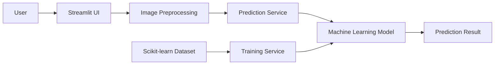
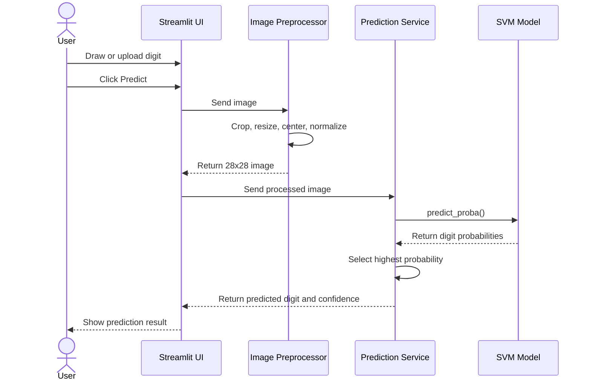

# Handwritten Digit Recognition System

A simple machine learning application that recognizes handwritten digits from 0 to 9.

This project is developed as a Python group final project.

## Features

- Draw or upload a handwritten digit
- Predict digits from 0 to 9
- Show prediction confidence
- Show model accuracy
- Compare different machine learning models
- Simple web interface using Streamlit

## Technologies

- Python
- Streamlit
- Scikit-learn
- NumPy
- Matplotlib
- TensorFlow / Keras (optional)

## Dataset

We use the handwritten digits dataset from Scikit-learn.

The dataset contains images of handwritten digits from 0 to 9. Because the dataset is included in Scikit-learn, we do not need to download a separate CSV file.

## System Design

### System Architecture



### Prediction Sequence Diagram



## Project Structure

```text
handwritten-digit-recognition/
├── app.py
├── data/
│   └── mnist_dataset.py
├── models/
│   └── svm_model.py
├── preprocessing/
│   └── image_preprocessor.py
├── services/
│   ├── training_service.py
│   └── prediction_service.py
├── utils/
│   └── evaluation.py
├── tests/
│   └── test_preprocessor.py
└── artifacts/
    └── mnist_svm.pkl
```

## Installation

Clone the project:

```bash
git clone <repository-url>
cd handwritten-digit-recognition
```
Install python: 3.11 ++

Install the required libraries:

```bash
pip install -r requirements.txt
```

## Run the Application

Run the Streamlit application:

```bash
streamlit run app.py
```

Then open the application in your browser.

## How It Works

1. The user draws or uploads a handwritten digit.
2. The system processes the image.
3. The processed image is sent to the machine learning model.
4. The model predicts a digit from 0 to 9.
5. The application shows the prediction and confidence score.

## Machine Learning Models

We plan to test and compare different machine learning models:

- Logistic Regression
- Random Forest
- Support Vector Machine
- Neural Network (optional)

We will compare the models and select a model based on accuracy and performance.

## Team Tasks

The project work will be divided into different parts:

- Data loading and preprocessing
- Machine learning model training
- Model evaluation
- Streamlit user interface
- Integration and testing
- Documentation

## Expected Result

At the end of the project, we expect to have a working web application where a user can draw or upload a handwritten digit.

The system will process the image and use a machine learning model to predict the number from 0 to 9.

The application will display the predicted digit, confidence score, and model performance.

## Team Members

- Member 1: ____________________
- Member 2: ____________________
- Member 3: ____________________
- Member 4: ____________________
